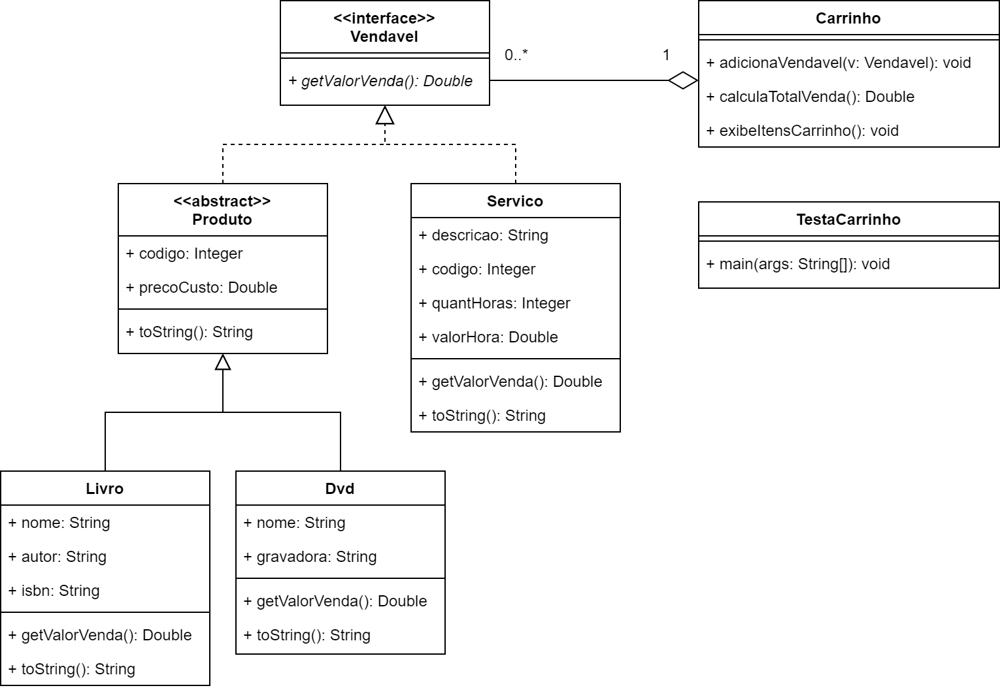

# Exercício - Interface

## Orientações Gerais: 🚨
1. Utilize **apenas** tipos **wrapper** para criar atributos e métodos.
2. **Respeite** os nomes de atributos e métodos definidos no exercício.
3. Tome **cuidado** com os **argumentos** especificados no exercício.
   **Não** adicione argumentos não solicitados e mantenha a ordem definida no enunciado.
4. Verifique se **não** há **erros de compilação** no projeto antes de enviar.
5. As classes devem seguir as regras de encapsulamento.
6. Deixe sempre um **construtor vazio** para utilização nos testes unitários.

## Exercício - Vendável



### Métodos da interface `Vendavel`

* `getValorVenda`:
  * método **abstrato** que será implementado nas classes que implementam essa interface.


### Métodos da classe `Servico`

* `getValorVenda`:
  * calcula o preço de venda do serviço, multiplicando a quantidade de horas pelo valor da hora do serviço.


### Métodos da classe `Livro`

* `getValorVenda`:
  * calcula o preço de venda como sendo o preço de custo do livro mais 10%.


### Métodos da classe `Dvd`

* `getValorVenda`:
  * calcula o preço de venda como sendo o preço de custo do DVD mais 20%.


### Métodos da classe `Carrinho`

* `adicionaVendavel`:
  * **recebe** um vendável e adiciona à lista de vendáveis do `Carrinho`.


* `calculaTotalVenda`:
  * **retorna** a soma do valor de venda de todos os vendáveis adicionados.


* `exibeItensCarrinho`:
  * exibe os itens adicionados no carrinho.


### Método `main`

Crie um objeto da classe Carrinho, chamado carrinho. \
Fique num loop, exibindo um menu, para o usuário escolher uma das opções:

```text
1. Adicionar livro
2. Adicionar DVD
3. Adicionar Servico
4. Exibir itens do carrinho
5. Exibir total de venda
6. Fim
```

Leia a opção digitada pelo usuário, e utilizando switch case, execute a opção selecionada.

Na opção 1, peça que o usuário digite os dados do livro e crie um objeto Livro com os dados digitados. 
Adicione esse objeto ao carrinho.

Faça o mesmo nas opções 2 e 3, para DVD e Servico, respectivamente.

A opção 4 deve exibir os itens do carrinho. \
A opção 5 deve exibir o total de venda dos itens do carrinho. \
A opção 6 deve configurar uma variável indicando que é o fim do loop.
